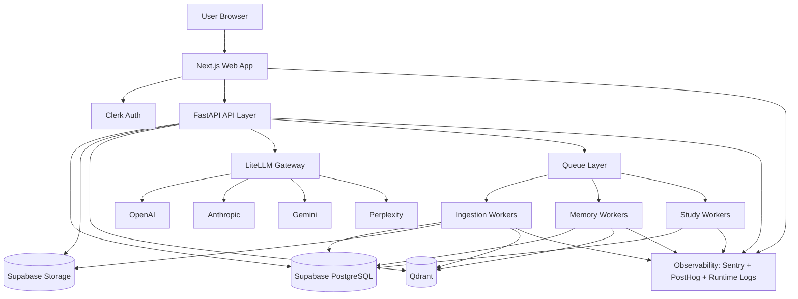
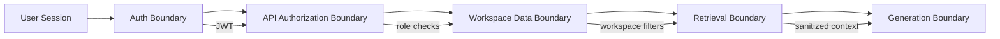

# 00 - Technical Blueprint (Epic-Driven)

## Purpose

This is the unified technical blueprint for Aproko AI V1.

Primary question answered:
> If 10 engineers join tomorrow, can they build without ad hoc clarification?

Use this as the architecture control plane across product, engineering, and operations.

## Delivery Scope (Phase 1: Technical Blueprint)

- AGENTS engineering constitution
- System architecture
- Database schema architecture
- API specification architecture
- Design system architecture
- AI memory architecture
- RAG pipeline architecture
- Security architecture
- Deployment architecture

## Epic Structure (Execution Model)

### Epic 1 - Foundation
- Monorepo and CI/CD
- Design system base
- Authentication and user management

### Epic 2 - Knowledge Workspace
- Dashboard
- Library
- File uploads
- Projects and folders

### Epic 3 - AI Core
- AI Gateway and model routing
- Chat orchestration
- Prompt assembly
- Streaming responses

### Epic 4 - Memory Engine
- Parsing, OCR/transcription
- Embeddings and vector indexing
- Retrieval, timeline, citations

### Epic 5 - Study and Research
- Notes
- Flashcards
- Quizzes
- Research workspace and cross-document comparison

### Epic 6 - Platform
- Billing
- Admin
- Analytics
- Notifications
- Audit logs

### Epic 7 - Future (Out of V1)
- Chrome extension
- Desktop overlay
- Mobile apps
- Teams and enterprise extensions

## Complete System Diagram

## Service Responsibilities

### Frontend (Next.js)
- Delivers UX for Home, Chat, Library, Memory, Research, Study, Settings, Billing.
- Handles interactive state and streaming UX.
- Never enforces final authorization logic client-side.

### Backend API (FastAPI)
- Resource and workflow orchestration under `/v1`.
- Auth/session verification and workspace access control.
- Retrieval + memory + generation composition.

### AI Gateway (LiteLLM)
- Single model-routing interface.
- Provider fallback and usage telemetry.

### Worker Tier
- Async ingestion and transformation.
- OCR/transcription, chunking, embeddings, memory extraction, study artifact generation.

### Storage Tier
- PostgreSQL: transactional and authorization-critical metadata.
- Storage bucket: source files and generated artifacts.
- Qdrant: vector retrieval acceleration.

## Data Flow: Upload -> AI Response

```mermaid
flowchart LR
  A[Upload File] --> B[Storage Write]
  B --> C[Source Metadata Persist]
  C --> D[Queue Ingestion Job]
  D --> E[Parse + OCR/Transcription]
  E --> F[Chunk + Metadata]
  F --> G[Embedding]
  G --> H[Qdrant Upsert]
  F --> I[Postgres Chunk Records]
  H --> J[Source Ready]
  I --> J
  J --> K[User Asks AI]
  K --> L[Hybrid Retrieve + Re-rank]
  L --> M[Prompt Assembly]
  M --> N[LiteLLM Generation]
  N --> O[Response + Citations]
  O --> P[Memory Update + Timeline Event]
```

## Memory and Search Operating Model

### Memory
- Short-term context for immediate continuity.
- Long-term/project/document/timeline memory for persistent value.
- Memory items require confidence and provenance thresholds before persistence.

### Search
- Hybrid retrieval (lexical + semantic) with reranking.
- Strict workspace-scoped filtering.
- Citation payload generated from top-ranked chunks.

## Security Boundaries

### Required Controls
- JWT validation on all protected endpoints.
- Workspace membership check for every read/write.
- Signed URL controls for file access.
- Provider credentials and secrets server-side only.
- Audit trail for privileged mutations.

## Scalability Strategy

### Horizontal Scaling
- Stateless web and API tier.
- Independent worker pools by job class.
- Vector and relational layers scaled independently.

### Throughput Strategy
- Queue absorbs ingestion and generation spikes.
- Retry and DLQ patterns for non-blocking reliability.
- Async-first heavy compute to keep UX responsive.

### Cost and Latency Strategy
- Tiered model routing and fallback in LiteLLM.
- Retrieval budget controls (top-k, token budget, rerank depth).
- Background batching for embeddings where safe.

`TODO`: Final SLOs per tier (API latency, ingestion completion window, chat response p95).

## Epic-to-Architecture Traceability

| Epic | Primary Components | Core Data Domains |
|------|--------------------|------------------|
| Epic 1 | Web shell, auth, CI/CD | profiles, memberships, accounts |
| Epic 2 | dashboard + library + projects | sources, versions, chunks |
| Epic 3 | chat + gateway + prompt orchestration | conversations, messages, citations |
| Epic 4 | workers + memory + retrieval | memory_items, timeline_events, vectors |
| Epic 5 | notes + study + research | notes, summaries, flashcards, quizzes |
| Epic 6 | billing + admin + analytics | subscriptions, billing_events, audits |
| Epic 7 | extension/desktop/mobile future | future domain models |

## Implementation Sequencing (Post-Blueprint)

1. Authentication
2. Dashboard
3. File Upload and Library
4. AI Chat
5. Memory and Search
6. Research and Study
7. Billing and Settings
8. Admin and Platform hardening

## Cross References

- Overall system architecture: `./01-overall-system-architecture.md`
- User journey architecture: `./02-user-journey.md`
- Memory engine: `../07-ai-memory/01-memory-engine.md`
- RAG pipeline: `../08-rag/01-rag-pipeline.md`
- PRD: `../01-prd/README.md`
- AGENTS constitution: `../../AGENTS.md`
