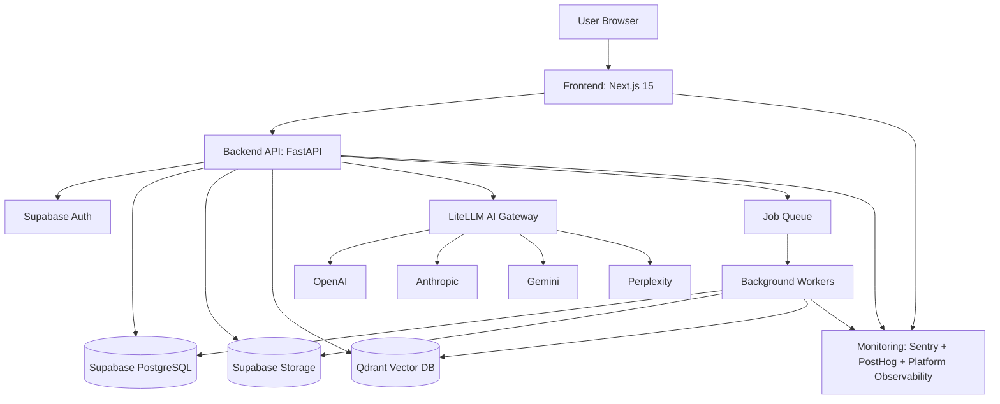
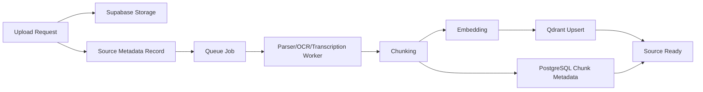
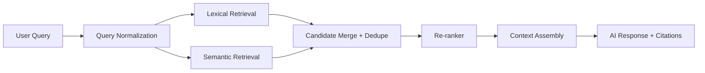
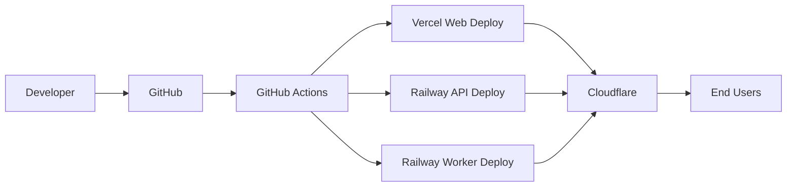
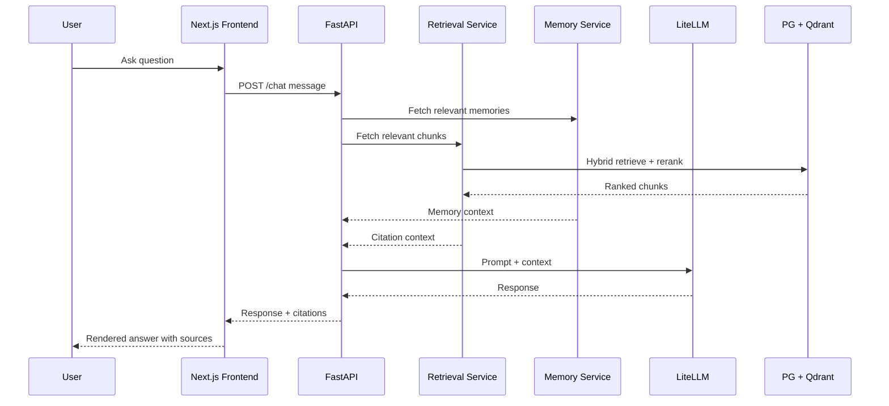

# 01 - Overall System Architecture

## Objective

Define how Aproko AI Version 1 works end-to-end across frontend, backend, AI systems, memory, search, processing pipelines, and production operations.

This document is the primary system architecture reference for implementation sequencing.

## Architecture Goals

- Deliver a web-first, knowledge-centric product with grounded AI outputs.
- Maintain strong tenant isolation and privacy defaults.
- Support asynchronous ingestion at scale.
- Keep UI fast while heavy processing runs in background workers.
- Ensure every critical path is observable in production.

## System Context

## Frontend Architecture

### Stack
- Next.js 15 App Router
- React 19 + TypeScript
- Tailwind CSS + shadcn/ui
- TanStack Query for server state
- Zustand for UI/session-local state

### Responsibilities
- Authentication entry and protected app shell
- Dashboard, chat, library, memory, research, study, settings, billing
- Real-time UX for ingestion and AI generation states
- Citation rendering and source navigation

### Frontend Boundaries
- No business-critical logic in client-only state.
- Authorization and data filtering are enforced server-side.
- All write operations go through backend APIs.

## Backend Architecture

### Core API Layer
- FastAPI REST service under `/v1`.
- Authenticated user and workspace-scoped operations.
- Orchestrates retrieval, memory access, and AI calls.

### Domain Services
- Workspace and membership service
- Source ingestion orchestration service
- Chat orchestration service
- Memory service
- Search service
- Study artifact service (flashcards/quizzes)
- Billing integration service

### Integration Layer
- Supabase clients for auth, relational data, storage
- Qdrant client for vector retrieval
- LiteLLM client for model abstraction and provider routing

## AI Gateway Architecture (LiteLLM)

### Purpose
- Unified model interface across providers.
- Centralized routing, fallback strategy, usage tracking.

### Responsibilities
- Provider selection by task type
- Retry/fallback policy for transient model failures
- Token and latency telemetry collection

### Constraints
- Never expose provider credentials to frontend.
- Prompt and retrieval metadata must be logged for traceability.

`TODO`: Final default model routing table by task (chat, summarize, OCR assist, study generation).

## Authentication Architecture

### Provider
- Supabase Auth

### V1 Flows
- Email/password sign-up and sign-in
- Google sign-in
- Password reset
- Session verification for protected routes

### Access Control
- Workspace membership-based authorization
- Role model: owner/editor/viewer/platform-admin
- Backend checks + DB access constraints

## File Processing Architecture

### Supported Inputs (V1)
- PDF, DOCX, PPTX, TXT, Markdown, images, audio

### Pipeline
1. Upload to object storage
2. Register source record
3. Dispatch processing job
4. Parse and extract text (OCR/transcription where needed)
5. Chunk extracted content
6. Generate embeddings
7. Persist chunk metadata and vector points
8. Mark source as ready

## Memory Engine Architecture

### Purpose
- Persist useful knowledge across sessions.

### Memory Classes
- Short-term chat memory
- Long-term workspace memory
- Timeline memory
- Document-derived memory

### Lifecycle (High-Level)
- Extract candidate memory from chats/files/summaries
- Score and deduplicate
- Persist and index
- Retrieve contextually during chat/search

`TODO`: Detailed lifecycle and scoring logic is defined in `docs/07-ai-memory/01-memory-engine.md`.

## Search Engine Architecture

### Retrieval Strategy
- Hybrid retrieval combining:
  - lexical search (PostgreSQL FTS)
  - semantic search (Qdrant ANN)
- Re-ranking by relevance + recency + source trust
- Citation object assembly from selected chunks

## Background Workers Architecture

### Worker Domains
- ingestion worker
- OCR/transcription worker
- embedding/indexing worker
- memory extraction worker
- study artifact generation worker

### Reliability Patterns
- idempotent jobs
- retry with exponential backoff
- dead-letter handling
- observable run states

`TODO`: Final queue and worker runtime selection (managed queue vs Redis-based queue) in implementation planning.

## Storage Architecture

### Relational Storage
- Supabase PostgreSQL for transactional data and metadata.

### Object Storage
- Supabase Storage for raw uploads and generated artifacts.

### Vector Storage
- Qdrant for embedding vectors and vector-filter metadata.

### Data Ownership
- PostgreSQL remains source of truth for authorization boundaries.
- Vector DB is retrieval acceleration, not permission source.

## Deployment Architecture

### Platforms
- Frontend: Vercel
- Backend API and workers: Railway (Dockerized)
- Edge and DNS controls: Cloudflare
- CI/CD: GitHub Actions

## Monitoring Architecture

### Error and Performance Monitoring
- Sentry for exception tracking and tracing.

### Product Analytics
- PostHog for product events and journey analytics.

### Runtime Observability
- Platform observability (logs/metrics/traces for deployments and services).
- Structured logging for API and workers.

### Monitoring Requirements
- Request ID propagation across frontend -> API -> workers.
- Failure correlation for ingestion, retrieval, and generation paths.
- Alerting for auth failures, queue lag, 5xx spikes, and AI provider degradation.

## End-to-End Request Path (Reference)

## Architecture Decisions and Open TODOs

- `TODO`: Final queue technology selection and operational model.
- `TODO`: Final model routing and fallback matrix by use case.
- `TODO`: Final retention, purge, and legal hold policy for memory and uploads.
- `TODO`: Final SLO targets (latency, uptime, ingestion completion windows).

## Cross References

- Product blueprint: `./PRODUCT_BLUEPRINT.md`
- PRD: `../01-prd/README.md`
- UX specification: `../06-wireframes/01-ux-specification.md`
- Memory architecture: `../07-ai-memory/01-memory-engine.md` (next)
- RAG pipeline: `../08-rag/01-rag-pipeline.md` (next)
