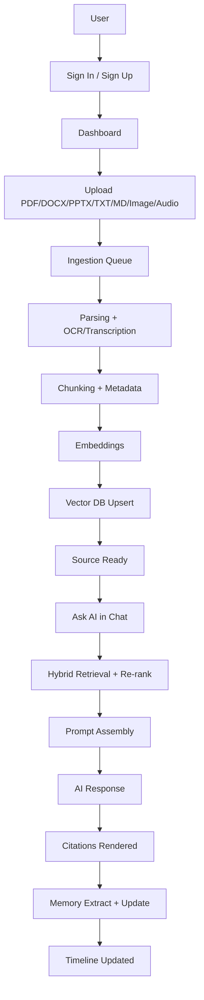

# 02 - User Journey Architecture

## Objective

Map the end-to-end user and system journey from authentication through knowledge ingestion, retrieval, grounded response generation, and memory updates.

This document translates UX flows into architecture-level system behavior.

## Core Journey (Reference Path)

## Journey Layers

Every major user flow is described with:
1. UX steps
2. API steps
3. Data steps
4. AI/runtime steps
5. Failure and fallback behavior

---

## Journey 1 - Authentication and Session Start

### UX Steps
- User lands on auth screen.
- User signs in with email/password or Google.
- User is redirected to Dashboard.

### API Steps
- `POST /v1/auth/sign-in` or `POST /v1/auth/google`
- session token validated on subsequent requests.
- `GET /v1/workspaces` to resolve active workspace context.

### Data Steps
- User identity resolved in auth provider.
- Profile and workspace membership loaded.

### AI/Runtime Steps
- None required.

### Failure/Fallback
- Invalid credentials -> actionable inline error.
- Session expired -> redirect to sign-in preserving return path.

---

## Journey 2 - First File Upload to Searchable Knowledge

### UX Steps
- User opens Library.
- User uploads one or more files.
- User sees per-file processing statuses (`uploaded`, `processing`, `ready`, `failed`).

### API Steps
- `POST /v1/workspaces/{workspace_id}/sources/upload-url`
- file upload to storage via signed URL.
- `POST /v1/workspaces/{workspace_id}/sources` to register source.
- worker status surfaced via `GET /v1/workspaces/{workspace_id}/sources`.

### Data Steps
- `sources` row created.
- `source_versions` created for processed revision.
- `source_chunks` persisted after parsing/chunking.
- `chunk_embeddings` and Qdrant point references persisted.

### AI/Runtime Steps
- OCR/transcription invoked based on media type.
- embedding model executed on chunks.

### Failure/Fallback
- Parse failure: source marked `failed`, user can reprocess.
- Unsupported file: validation error before queue dispatch.
- Partial extraction: mark quality flag and allow manual review.

---

## Journey 3 - Grounded AI Chat with Citations

### UX Steps
- User opens Chat and selects scope (selected docs/project/workspace).
- User asks a question.
- Response streams in.
- User inspects citations and source snippets.

### API Steps
- `POST /v1/workspaces/{workspace_id}/chat/sessions` (if needed)
- `POST /v1/workspaces/{workspace_id}/chat/sessions/{session_id}/messages`
- backend orchestrates retrieval + generation + citation payload.

### Data Steps
- user and assistant messages stored in `messages`.
- citation links stored in `message_citations`.

### AI/Runtime Steps
- Query normalization.
- Hybrid retrieval (FTS + vector).
- Re-ranking and context assembly.
- LiteLLM model call.
- Citation mapping to source chunks.

### Failure/Fallback
- Low retrieval confidence -> model instructed to express uncertainty.
- Model timeout -> retry/fallback model based on policy.
- Citation assembly failure -> response withheld or marked ungrounded (policy controlled).

---

## Journey 4 - Memory and Timeline Evolution

### UX Steps
- User continues interacting over time.
- Memory timeline surfaces key events and facts.
- User can inspect and manage memory artifacts.

### API Steps
- `GET /v1/workspaces/{workspace_id}/memory`
- `GET /v1/workspaces/{workspace_id}/timeline`
- `POST /v1/workspaces/{workspace_id}/memory/rebuild` (admin/maintenance path)

### Data Steps
- `memory_items` upserted from chats/files/summaries.
- `timeline_events` emitted/updated for user-visible chronology.

### AI/Runtime Steps
- memory candidate extraction.
- dedupe and scoring.
- retrieval-time memory selection for future prompts.

### Failure/Fallback
- noisy memory extraction -> confidence threshold prevents persistence.
- stale memory -> lifecycle policy demotes or archives entries.

---

## Journey 5 - Research and Study Artifact Generation

### UX Steps
- User selects multiple documents in Research.
- User generates structured summary and saves note.
- User generates flashcards/quizzes from notes/files.

### API Steps
- `POST /v1/workspaces/{workspace_id}/summaries`
- flashcard/quiz generation endpoints.

### Data Steps
- summary artifacts in `summaries`.
- study entities in `flashcard_decks`, `flashcards`, `quizzes`, etc.

### AI/Runtime Steps
- multi-document retrieval.
- structured generation templates.
- quality checks for duplicate/low-value questions.

### Failure/Fallback
- generation failure -> retry with reduced scope.
- output quality below threshold -> prompt user to refine source selection.

---

## Journey 6 - Billing and Access Control

### UX Steps
- User checks plan and usage in Billing.
- User upgrades/downgrades.
- Feature gates update accordingly.

### API Steps
- `GET /v1/billing/subscription`
- `POST /v1/billing/checkout`
- `POST /v1/billing/webhooks` (provider callback)

### Data Steps
- `subscriptions` state transitions.
- immutable `billing_events` append.

### AI/Runtime Steps
- None directly, except gating expensive AI operations.

### Failure/Fallback
- webhook delay -> temporary pending state with eventual consistency handling.

---

## Cross-Cutting Journey Controls

### Observability
- request IDs propagated across frontend, API, workers.
- ingestion and generation stages logged with durations.
- Sentry captures runtime exceptions.
- PostHog tracks product funnel events.

### Security
- all user journeys enforce workspace scope checks.
- signed URLs for upload/download.
- role-aware access for billing/admin actions.

### Performance
- long-running operations shifted to workers.
- UI shows stage-aware progress and retries.
- chat endpoints prioritize low-latency path for interaction continuity.

## Open TODOs

- `TODO`: Final SLO targets for each journey (auth, upload, chat, memory update).
- `TODO`: Explicit retry budgets and timeout thresholds per stage.
- `TODO`: Final user-visible wording for confidence/uncertainty states.

## Cross References

- Overall architecture: `./01-overall-system-architecture.md`
- UX spec: `../06-wireframes/01-ux-specification.md`
- Memory engine: `../07-ai-memory/01-memory-engine.md`
- RAG pipeline: `../08-rag/01-rag-pipeline.md`
