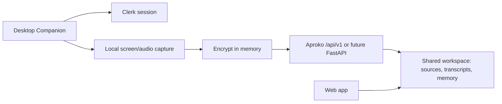

# 03 — Desktop Companion (V2 Design Only)

Status: **Design stub — not approved for implementation**  
Parent board: `docs/12-backlog/sprint-19-web-study-copilot.md`  
Constitution: `AGENTS.md` (V2 companion scope)

## Purpose

Capture capabilities that **cannot** be delivered honestly in a browser alone, while keeping one shared Aproko workspace backend.

## Problem

Web V1.1 supports:

- User-gesture mic recording
- File/audio upload + Whisper STT
- Grounded chat, study generation, writing polish

Web **cannot** reliably provide:

- Floating always-on overlay that reads arbitrary desktop windows
- Invisible OS audio tap of Zoom/Meet/Teams without an in-meeting bot or explicit share UI
- Background capture when the browser tab is closed

## Proposed V2 product shape

A lightweight **desktop companion** (macOS/Windows first; Electron or Tauri TBD) that:

1. Authenticates to the same Clerk account / workspace
2. Captures permitted screen/audio with OS permissions
3. Uploads encrypted packets to Aproko APIs (`sources` / `transcripts` contracts)
4. Leaves chat, study, memory, billing, and library UX on the web app

## Non-goals (still forbidden)

- Marketing detector-evasion “humanizer” tooling
- Shipping native mobile apps in the same epic without a separate PRD
- Silent capture without user consent / OS permission prompts

## Open decisions (`TODO`)

- [ ] Electron vs Tauri vs native Swift/C#
- [ ] Whether companion is required for Pro plan or optional add-on
- [ ] Retention policy for local buffered audio before upload
- [ ] Whether vision (OCR of slides) is V2.0 or V2.1
- [ ] Packaging, code signing, and auto-update channel

## Entry criteria before coding

1. Product owner approval of this epic in backlog
2. Security/privacy review of local capture + upload
3. API contract for companion ingestion documented in `docs/04-api`
4. AGENTS.md still marks native companion as V2 (not V1 default)

## Exit criteria for design phase

This file exists and is linked from the constitution, docs hub, and Sprint 19 board.  
**No production companion binary ships under Sprint 19.**
