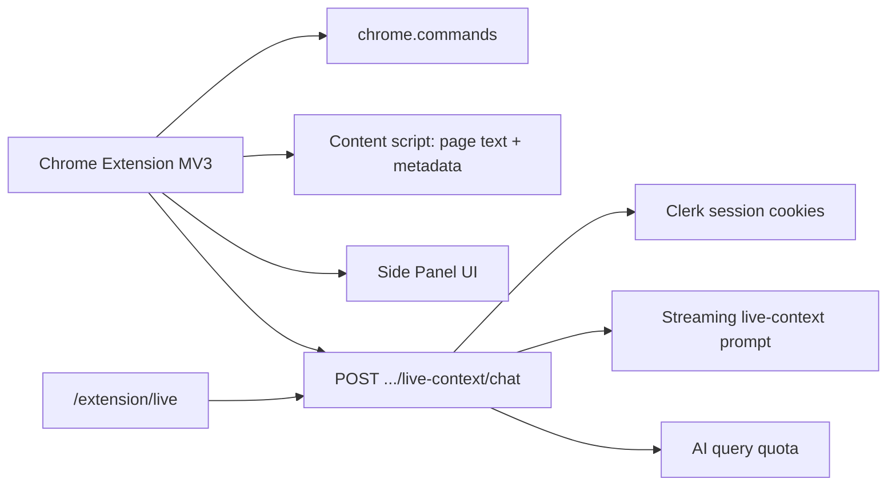

# 04 — Browser Extension Companion (V2)

Status: **Approved for implementation (Sprint 29)** — product owner approved 2026-08-16  
Source input: `docs/12-backlog/inputs/cursor_prompt-screen-live-context.md`  
Sibling surface: `docs/02-architecture/03-desktop-companion-v2.md`  
Backlog: `docs/12-backlog/sprint-29-browser-extension-v2.md`  
Package: `apps/extension/extension` (`@aproko/extension`)  
Constitution: `AGENTS.md` (V2 companion — browser live context; not a V1 default surface)

## Purpose

Capture **active browser tab** context (DOM text, metadata, shortcuts, side panel)
that a pure web app cannot do when the user is on another origin — while keeping
chat, billing, memory, and library on the existing Aproko web app.

This is the **browser-scoped** companion path. OS-wide screen/audio capture remains
the desktop companion epic (`03-desktop-companion-v2.md`).

## Shipped MVP shape

1. **Chrome Extension (Manifest V3)** — `apps/extension/extension` (v0.3+)
   - Background service worker + `Ctrl/Cmd+Shift+Y` (full-page capture) and `Ctrl/Cmd+Shift+H` (hover-context capture); panel opens via toolbar icon
   - Content script: throttled cursor hover (`elementFromPoint`, ~175ms) + on-demand full-page scrape for “Capture tab” and Alt/Option-click solve
   - Shadow DOM capture chip + live hover preview
   - Side panel embeds `/extension/live?embed=1` (Clerk cookies)
   - Live UI: structured **Cursor focus** card + **Page snapshot** topic summary
2. **Safari Web Extension** — `apps/extension/safari` (synced from Chrome via `pnpm --filter @aproko/extension sync:safari`)
   - Same capture / hover / solve behavior
   - Toolbar **popup** instead of Chrome side panel (Safari has no `sidePanel` API)
3. **Aproko web (`apps/web`)**
   - `POST /api/v1/workspaces/{workspaceId}/live-context/chat` (SSE)
   - Alias: `POST /api/chat` (FasterFlow-shaped body → same live-context handler)
   - Alias: `.../live-context/context-stream`
   - Prompt prioritizes `activeHoverContext`, uses full page as background
   - `/extension/live` dashboard + `/extension/connect` checklist
   - CORS / CSP allow `chrome-extension:` and `safari-web-extension:` embeds

## Auth model (MVP)

Extension side panel resolves workspace via `GET /api/v1/workspaces/current` and posts
live-context chat with `credentials: 'include'`. User must be signed into Aproko in the
same Chrome profile. Host permissions cover localhost + production Vercel host.

## Security & privacy baseline

- Explicit user gesture / command to capture; no silent always-on scrape
- Origin allowlist helpers for CORS preflight (`APROKO_EXTENSION_ORIGIN_ALLOWLIST`)
- Truncate / redact oversized / password-like `pageText` before generation
- Clerk-authenticated API + workspace membership + usage metering
- Analytics event: `live_context_chat_requested`

## Non-goals (still deferred)

- OS-level meeting audio / desktop window capture (desktop companion)
- Detector-evasion writing tools
- Persist captures as workspace `sources` (ephemeral chat context only for MVP)
- Edge Chromium packaging polish beyond Chrome load-unpacked

## Open decisions (`TODO`)

- [x] Product owner approval of Sprint 29
- [ ] Chrome + Edge + Safari store listing / packaging
- [x] Safari Web Extension package (`apps/extension/safari`) + converter docs
- [x] Side panel MVP (overlay chip included as secondary affordance)
- [ ] Persist captured sessions as workspace sources
- [ ] Optional longer-lived extension token handoff (if cookies prove brittle)
- [ ] Plan entitlement (Pro-only companion vs free trial)

## Entry criteria before coding

1. ~~Product owner marks Sprint 29 approved~~ done
2. Security/privacy review of DOM capture + upload — baseline shipped; deepen before store release
3. API contract in `docs/04-api` — live-context endpoint documented
4. `AGENTS.md` still marks this as V2 companion (not V1 default)
