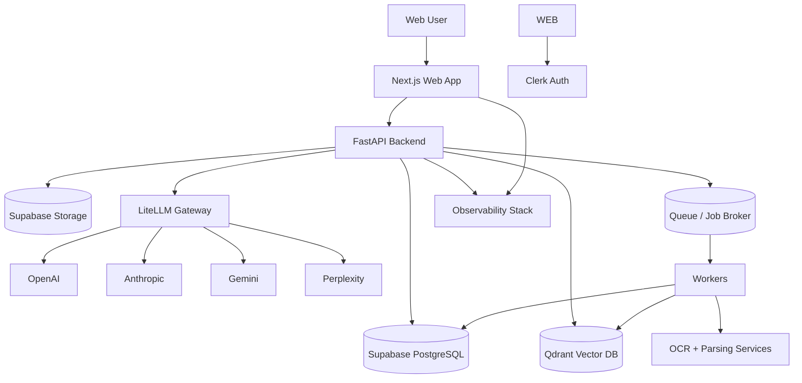
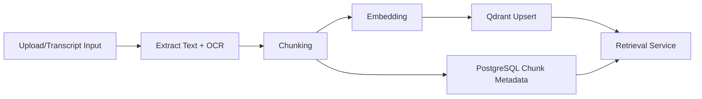
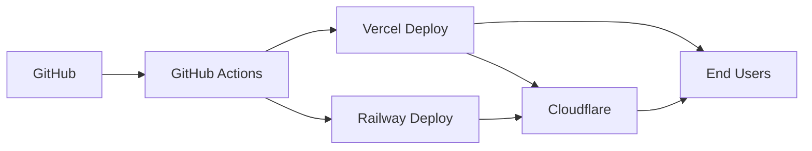

# 02 - System Architecture

## Goals

- Grounded AI responses over user knowledge
- Reliable ingestion/indexing at scale
- Strong tenant isolation and observability
- Independent deployability of frontend and backend services

## High-Level Architecture

## Frontend

- Next.js 15 App Router (web-first)
- React 19 + TypeScript
- Tailwind + shadcn/ui
- TanStack Query for server state
- Zustand for UI/local workflow state

Responsibilities:
- Authenticated user experience
- Research workspace interfaces
- Upload, chat, notes, study tools, timeline views
- API consumption with strict type contracts

## Backend

- FastAPI service as primary REST API
- Python worker services for async processing
- Clear separation:
  - synchronous request/response APIs
  - asynchronous ingestion and indexing pipelines

## API Layer

- REST-first design
- Versioned path strategy (`/v1/...`)
- JSON responses with consistent error envelope
- Cursor pagination for list endpoints

## Authentication

- Clerk for identity and session management
- Authentication flows in V1: email/password, Google OAuth, password reset, user profile management
- Backend validates JWTs and enforces workspace authorization
- Row-level access strategy in PostgreSQL + backend checks

## Storage

- Supabase Storage for raw files and derived artifacts
- Logical buckets by content class (docs, transcripts, images, audio, exports)
- Signed URLs for controlled access

## AI Gateway

- LiteLLM provides model abstraction/routing and fallback policy
- Provider adapters: OpenAI, Anthropic, Gemini, Perplexity
- Request metadata captured for cost/latency telemetry

`TODO`: Define final default model mapping per task type (chat, summary, OCR fallback, quiz generation).

## Workers

Asynchronous workers handle:
- document parsing
- OCR
- chunking and embedding
- vector indexing
- summary/artifact generation jobs

## Queue

- Queue decouples ingestion from user-facing APIs
- Supports retries, dead-letter queue, backoff policies

`TODO`: Confirm queue technology for V1 (Redis queue vs managed queue service).

## Search

- Hybrid retrieval pipeline:
  - lexical (PostgreSQL FTS)
  - semantic (Qdrant ANN)
- re-ranking stage combines relevance + recency + source confidence

## Memory Engine

- Builds structured memory entities from conversations and sources
- Persists short-term and long-term memory objects
- powers timeline and context assembly for chat

## Embedding Pipeline

## Monitoring and Analytics

- **Sentry**: runtime errors, traces, release health
- **PostHog**: product analytics and funnel events
- **Platform Observability**:
  - Vercel Observability for frontend/service insights
  - runtime log analysis and deployment diagnostics

Note from current official docs reviewed:
- Vercel Observability is available across plans; Observability Plus extends retention and analysis capabilities.
- Vercel Services supports multi-service deployments in one project (beta), useful for frontend + backend path-based routing.

`TODO`: Decide whether V1 deploys backend via Vercel Services path routing or Railway-first API domain split.

## Deployment Topology

- Frontend: Vercel
- Backend API + workers: Railway (containerized)
- Edge/DNS/security layer: Cloudflare
- CI/CD: GitHub Actions

## Security Architecture

- JWT validation + role checks per request
- tenant isolation by workspace/account
- signed file access
- encrypted transport (TLS)
- secrets via environment manager only
- audit logging for privileged operations

## Cross References

- Database design: `../03-database/README.md`
- API contracts: `../04-api/README.md`
- AI memory: `../07-ai-memory/README.md`
- RAG architecture: `../08-rag/README.md`
- Deployment/ops: `../11-deployment/README.md`
