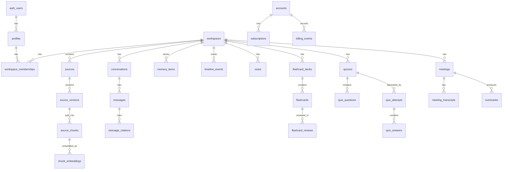

# 03 - Database Design (PostgreSQL)

## Principles

- Normalized schema for transactional consistency
- Multi-tenant isolation by `workspace_id`
- Soft delete for user-generated content
- Complete audit fields for traceability
- Hybrid search support (FTS metadata + vector references)

## Core ER Diagram

## Table Definitions

### Identity and Membership

1. `profiles`
- `id uuid pk` (references `auth.users.id`)
- `email text unique not null`
- `full_name text`
- `avatar_url text`
- `created_at timestamptz not null default now()`
- `updated_at timestamptz not null default now()`

2. `workspaces`
- `id uuid pk`
- `account_id uuid not null`
- `name text not null`
- `slug text unique not null`
- `created_by uuid not null`
- audit fields + soft delete

3. `workspace_memberships`
- `id uuid pk`
- `workspace_id uuid not null`
- `user_id uuid not null`
- `role text not null check (role in ('owner','editor','viewer'))`
- unique (`workspace_id`, `user_id`)
- audit fields

### Content Ingestion

4. `sources`
- represents uploaded source entity
- `source_type text` (`pdf`,`pptx`,`docx`,`txt`,`markdown`,`image`,`audio`,`transcript`,`note_import`)
- `storage_path text not null`
- `status text` (`uploaded`,`processing`,`ready`,`failed`)
- `workspace_id` FK + audit + soft delete

5. `source_versions`
- immutable ingestion versions
- parser and extraction metadata
- `language text`, `page_count int`, `token_count int`
- unique (`source_id`,`version_number`)

6. `source_chunks`
- chunk text and metadata
- `chunk_index int not null`
- `content text not null`
- `start_offset int`, `end_offset int`
- `metadata jsonb not null default '{}'::jsonb`
- unique (`source_version_id`,`chunk_index`)

7. `chunk_embeddings`
- embedding records with model metadata
- `chunk_id uuid not null`
- `embedding_model text not null`
- `vector_id text not null` (maps to Qdrant point id)
- `dimension int not null`
- unique (`chunk_id`,`embedding_model`)

### Conversation and Memory

8. `conversations`
- `title text`
- `workspace_id`, `created_by`
- `context_mode text` (`workspace`,`selected_sources`,`global`)
- audit + soft delete

9. `messages`
- `conversation_id`, `role text` (`system`,`user`,`assistant`,`tool`)
- `content jsonb not null`
- `token_input int`, `token_output int`
- `model_used text`
- audit + soft delete

10. `message_citations`
- maps assistant messages to chunks/sources
- `message_id`, `chunk_id`, `confidence numeric(5,4)`

11. `memory_items`
- canonical memory objects
- `memory_type text` (`fact`,`preference`,`project`,`decision`,`task`,`timeline_event`)
- `content jsonb`
- `importance_score numeric(5,4)`
- `last_referenced_at timestamptz`
- `workspace_id` FK + soft delete

12. `timeline_events`
- rendered timeline units
- links to source/message/memory as optional refs
- `event_type text`, `event_time timestamptz`, `summary text`

### Notes and Study

13. `notes`
- rich text/json content
- optional linkage to conversation/source

14. `flashcard_decks`
15. `flashcards`
16. `flashcard_reviews`
- SM-2 style review metadata fields (ease, interval, due_at)

17. `quizzes`
18. `quiz_questions`
19. `quiz_attempts`
20. `quiz_answers`

### Meeting Intelligence

21. `meetings`
- title, meeting date, participants metadata

22. `meeting_transcripts`
- transcript body + diarization metadata + processing status

23. `summaries`
- generic summary artifacts
- `summary_type text` (`meeting`,`document`,`workspace`,`research`)

### Billing and Accounts

24. `accounts`
- account owner + org-level metadata

25. `subscriptions`
- provider ids, plan code, status, current period fields

26. `billing_events`
- webhook/event log for billing lifecycle changes

## Relationships and Constraints

- every user-generated object must map to `workspace_id`.
- FK delete behavior:
  - default `restrict` for critical entities
  - `cascade` for pure children (e.g., chunk embeddings)
- role constraints enforced by membership table + RLS + backend authorization.

## Index Strategy

- B-tree indexes:
  - `workspace_id` on all workspace-scoped tables
  - `(workspace_id, created_at desc)` for activity feeds
  - `status` for processing queues
  - `slug` unique indexes where needed
- GIN indexes:
  - `to_tsvector` on searchable text fields (notes, chunk content shadow tables)
  - `jsonb_path_ops` on metadata-heavy tables where needed
- Partial indexes:
  - active records only (`deleted_at is null`) for hot paths

## Soft Delete Strategy

All user-controlled content tables include:
- `deleted_at timestamptz null`
- `deleted_by uuid null`

Application queries default to `deleted_at is null`.
Hard purge is asynchronous and policy-driven.

`TODO`: Define retention periods and legal hold behavior.

## Audit Fields

Standard columns on mutable entities:
- `created_at timestamptz not null default now()`
- `updated_at timestamptz not null default now()`
- `created_by uuid`
- `updated_by uuid`

## Qdrant Integration Notes

- PostgreSQL stores source/chunk metadata and Qdrant point references.
- Qdrant stores vectors + selected metadata payload for fast filtering.
- source of truth for authorization remains PostgreSQL.

## Cross References

- API: `../04-api/README.md`
- Memory model: `../07-ai-memory/README.md`
- RAG retrieval: `../08-rag/README.md`
