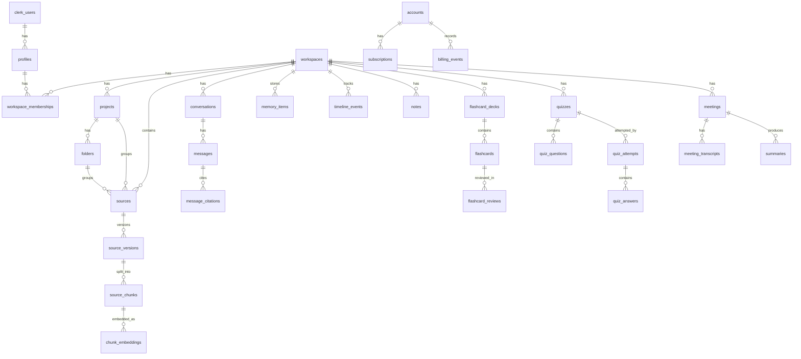

# 03 - Database Design (PostgreSQL)

## Principles

- Normalized schema for transactional consistency
- Multi-tenant isolation by `workspace_id`
- Soft delete for user-generated content
- Complete audit fields for traceability
- Hybrid search support (FTS metadata + vector references)

## Core ER Diagram

## Table Definitions

### Identity and Membership

1. `profiles`

- `id uuid pk`
- `clerk_user_id text unique not null` (external identity key from Clerk)
- `email text unique not null`
- `full_name text`
- `avatar_url text`
- `preferences jsonb not null default '{}'` — AI prefs (`defaultChatModel`, `autoMemoryCapture`); migration `202607161400_profiles_preferences.sql`
- `created_at timestamptz not null default now()`
- `updated_at timestamptz not null default now()`

2. `workspaces`

- `id text pk` (personal workspaces use `ws_<clerk_user_id>`)
- `name text not null`
- `slug text unique not null`
- `created_by_clerk_user_id text not null`
- audit fields (`created_at`, `updated_at`)

3. `workspace_memberships`

- `id uuid pk`
- `workspace_id text not null` (FK → `workspaces.id`)
- `clerk_user_id text not null`
- `role text not null` (`owner` | `editor` | `viewer`)
- unique (`workspace_id`, `clerk_user_id`)
- `created_at`

Migration: `supabase/migrations/202607161500_create_workspaces_and_memberships.sql`.
Content tables continue to store `workspace_id` as text (no FK rewrite in that migration).

4. `projects`

- `id uuid pk`
- `workspace_id uuid not null`
- `name text not null`
- `slug text not null`
- unique (`workspace_id`, `slug`)
- audit fields

5. `folders`

- `id uuid pk`
- `workspace_id uuid not null`
- `project_id uuid not null`
- `name text not null`
- `slug text not null`
- unique (`project_id`, `slug`)
- audit fields

### Content Ingestion

6. `sources`

- represents uploaded source entity
- `source_type text` (`pdf`,`pptx`,`docx`,`txt`,`markdown`,`image`,`audio`,`transcript`,`note_import`)
- `storage_path text not null`
- `project_id uuid null` (references `projects.id`)
- `folder_id uuid null` (references `folders.id`)
- `status text` (`uploaded`,`processing`,`ready`,`failed`)
- `workspace_id` FK + audit + soft delete

7. `source_versions`

- immutable ingestion versions
- parser and extraction metadata
- `language text`, `page_count int`, `token_count int`
- unique (`source_id`,`version_number`)

8. `source_chunks`

- chunk text and metadata
- `chunk_index int not null`
- `content text not null`
- `start_offset int`, `end_offset int`
- `metadata jsonb not null default '{}'::jsonb`
- unique (`source_version_id`,`chunk_index`)

9. `chunk_embeddings`

- embedding records with model metadata
- `chunk_id uuid not null`
- `embedding_model text not null`
- `vector_id text not null` (maps to Qdrant point id)
- `dimension int not null`
- unique (`chunk_id`,`embedding_model`)

### Conversation and Memory

10. `conversations`

- `title text`
- `workspace_id`, `created_by`
- `context_mode text` (`workspace`,`selected_sources`,`global`)
- audit + soft delete

11. `messages`

- `conversation_id`, `role text` (`system`,`user`,`assistant`,`tool`)
- `content jsonb not null`
- `token_input int`, `token_output int`
- `model_used text`
- audit + soft delete

12. `message_citations`

- maps assistant messages to chunks/sources
- `message_id`, `chunk_id`, `confidence numeric(5,4)`

13. `memory_items`

- canonical memory objects
- `memory_type text` (`fact`,`preference`,`project`,`decision`,`task`,`timeline_event`)
- `content jsonb`
- `importance_score numeric(5,4)`
- `last_referenced_at timestamptz`
- `workspace_id` FK + soft delete

14. `timeline_events`

- rendered timeline units
- links to source/message/memory as optional refs
- `event_type text`, `event_time timestamptz`, `summary text`

### Notes and Study

15. `notes`

- rich text/json content
- optional linkage to conversation/source

15b. `writing_drafts`

- per-user writing polish drafts (`workspace_id`, `clerk_user_id`)
- fields: `title`, `draft_text`, `polished_text`, `mode`
- migration: `supabase/migrations/202607161200_create_writing_drafts.sql`

16. `flashcard_decks`
17. `flashcards`
18. `flashcard_reviews`

- SM-2 style review metadata fields (ease, interval, due_at)

19. `quizzes`
20. `quiz_questions`
21. `quiz_attempts`
22. `quiz_answers`

### Meeting Intelligence

23. `meetings`

- title, meeting date, participants metadata

24. `meeting_transcripts`

- transcript body + diarization metadata + processing status

25. `summaries`

- generic summary artifacts
- `summary_type text` (`meeting`,`document`,`workspace`,`research`)

### Billing and Accounts

26. `accounts`

- account owner + org-level metadata

27. `subscriptions`

- provider ids, plan code, status, current period fields

28. `billing_events`

- webhook/event log for billing lifecycle changes

## Relationships and Constraints

- every user-generated object must map to `workspace_id`.
- FK delete behavior:
  - default `restrict` for critical entities
  - `cascade` for pure children (e.g., chunk embeddings)
- role constraints enforced by membership table + RLS + backend authorization.

## Index Strategy

- B-tree indexes:
  - `workspace_id` on all workspace-scoped tables
  - `(workspace_id, created_at desc)` for activity feeds
  - `status` for processing queues
  - `slug` unique indexes where needed
- GIN indexes:
  - `to_tsvector` on searchable text fields (notes, chunk content shadow tables)
  - `jsonb_path_ops` on metadata-heavy tables where needed
- Partial indexes:
  - active records only (`deleted_at is null`) for hot paths

## Soft Delete Strategy

All user-controlled content tables include:

- `deleted_at timestamptz null`
- `deleted_by uuid null`

Application queries default to `deleted_at is null`.
Hard purge is asynchronous and policy-driven.

`TODO`: Define retention periods and legal hold behavior.

## Audit Fields

Standard columns on mutable entities:

- `created_at timestamptz not null default now()`
- `updated_at timestamptz not null default now()`
- `created_by uuid`
- `updated_by uuid`

## Clerk Identity Strategy

- Clerk is the source of truth for authentication and user sessions.
- Every user-owned or user-authored record should carry a `clerk_user_id` reference (directly or via author fields).
- `profiles.clerk_user_id` is globally unique and used to resolve workspace membership and ownership.
- Supabase Auth is not used in this architecture.

## Qdrant Integration Notes

- PostgreSQL stores source/chunk metadata and Qdrant point references.
- Qdrant stores vectors + selected metadata payload for fast filtering.
- source of truth for authorization remains PostgreSQL.

## Cross References

- API: `../04-api/README.md`
- Memory model: `../07-ai-memory/README.md`
- RAG retrieval: `../08-rag/README.md`
