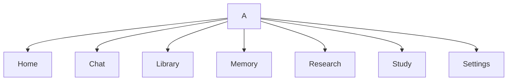
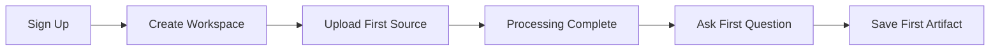
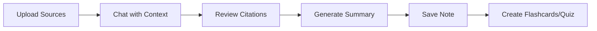
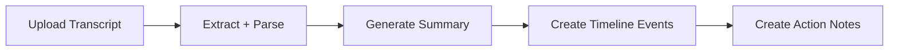

# 06 - Wireframes and UX Flows

## Information Architecture (V1)

## Primary Screen Wireframes (Textual)

### 1) Workspace Home
- Left: workspace navigation
- Center: recent sources, recent chats, tasks
- Right: memory highlights and timeline snapshot

### 2) Chat Workspace
- Left: session list + filters
- Center: threaded chat + composer
- Right: citations panel + source preview + memory context

### 3) Library
- Table/grid by source type (PDF/DOCX/PPTX/TXT/Markdown/Image/Audio/Transcript)
- Processing status chips
- Source detail view: extracted text, metadata, chunks, references

### 4) Notes Studio
- Notes list + tags
- Rich note editor
- Linked sources/conversations section

### 5) Study Hub
- Deck list and quiz list
- Generate from source/note controls
- Review and attempt history widgets

### 6) Timeline View
- Chronological event feed
- filters: source type, workspace, actor, date range

### 7) Settings
- Profile
- AI preferences
- Privacy controls
- Workspace settings
- Billing

### 8) Authentication
- Email/password sign-in
- Google sign-in
- Password reset

### 9) Admin Dashboard
- user/workspace metrics
- ingestion health
- model usage/cost trends
- billing state overview

## Key User Flows

### Onboarding Flow

### Research Flow

### Meeting Transcript Flow

## UX Constraints

- Every AI response should expose provenance path (where possible).
- Long-running ingestion must have clear asynchronous status states.
- Empty states should teach the next best action.

## Open Wireframe TODOs

- `TODO`: Produce high-fidelity screens for design review.
- `TODO`: Confirm tablet breakpoint behavior for split-pane chat.
- `TODO`: Finalize admin metrics visual hierarchy with PM team.

## Cross References

- Design system: `../05-design-system/README.md`
- PRD user flows: `../01-prd/README.md`
