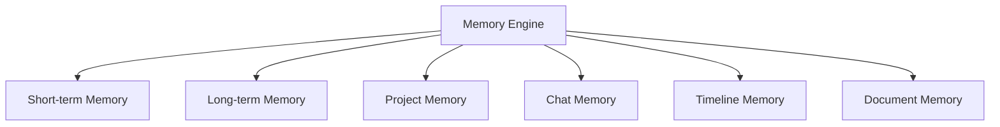
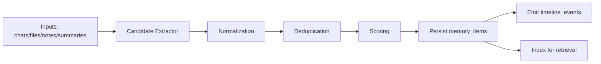
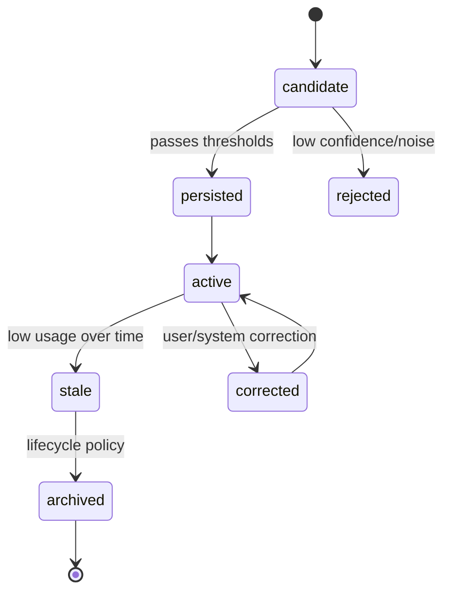

# 01 - Memory Engine Architecture

## Objective

Define Aproko AI's memory system as a durable, privacy-aware, retrieval-optimized knowledge layer that improves user outcomes across sessions.

Memory is a first-class product capability, not a side effect of chat logs.

## Memory Design Principles

- Preserve useful context, not every interaction.
- Keep memory explainable and traceable to sources.
- Prioritize precision over aggressive recall for persisted memory.
- Use lifecycle controls to avoid stale or noisy memory.
- Respect workspace isolation and user privacy settings.

## Memory Taxonomy

### 1) Short-term Memory
- Session-near context window.
- Includes recent turns, active task intent, and current scoped sources.
- Optimized for immediate conversational continuity.

### 2) Long-term Memory
- Durable facts, preferences, recurring goals, and validated insights.
- Persisted across sessions and reused when contextually relevant.

### 3) Project Memory
- Scoped to a project/workspace domain.
- Captures project-specific terminology, milestones, and derived summaries.

### 4) Chat Memory
- Conversation-level memory extracted from multi-turn interactions.
- Includes unresolved follow-ups and persistent decision points.

### 5) Timeline Memory
- Chronological events visible to users.
- Anchors system understanding in “what happened when”.

### 6) Document Memory
- Derived facts and concepts from uploaded files and generated notes/summaries.
- Keeps provenance links to original document sections.

## Memory Data Model Mapping

Primary tables:
- `memory_items`
- `timeline_events`
- `messages`
- `message_citations`
- `sources`
- `source_chunks`

Each memory item should include:
- workspace scope
- memory type
- normalized content payload
- provenance references
- confidence score
- importance score
- lifecycle state

`TODO`: Final JSON schema for memory payload types.

## Memory Ingestion Architecture

## Ingestion Stages

### Stage 1 - Candidate Extraction
- identify potential memory statements/events from:
  - assistant/user turns
  - document chunks
  - generated summaries
  - notes and study outputs

### Stage 2 - Normalization
- convert candidate into canonical schema with typed fields.
- attach source references and origin metadata.

### Stage 3 - Deduplication
- exact and semantic dedupe against existing memory store.
- merge strategy for near-duplicate items.

### Stage 4 - Scoring
- confidence score (is this true and grounded?)
- importance score (how useful over time?)
- recency impact factor

### Stage 5 - Persistence
- upsert into `memory_items`.
- emit timeline projections where user-visible chronology is valuable.

## Retrieval Strategy

### Retrieval Inputs
- current user query
- active workspace/project scope
- active conversation context

### Retrieval Layers
1. high-relevance short-term retrieval
2. long-term/project memory retrieval
3. timeline recency enrichments
4. document memory cross-check for grounding

### Ranking Heuristics
- semantic relevance
- confidence threshold
- recency decay
- memory type weighting
- source trust weighting

`TODO`: Final memory ranking weight calibration.

## Context Assembly Contract

Memory context should be packaged as structured blocks:
- `facts`
- `preferences`
- `project_context`
- `recent_events`
- `document_insights`

Each block includes provenance hints to support explainability and citation-safe generation.

## Memory Lifecycle Management

### Lifecycle States
- candidate
- active
- stale
- corrected
- archived
- rejected

### Lifecycle Policies
- periodic stale-memory review jobs.
- promotion/demotion based on usage and confidence updates.
- user override controls for correction and deletion.

`TODO`: Final retention windows and archival/purge schedules by plan and compliance policy.

## Guardrails and Safety

- never persist low-confidence synthetic claims as long-term memory.
- require provenance for high-impact memory categories (decisions/tasks/facts).
- enforce workspace boundary checks on every memory retrieval.
- redact or suppress memory classes per privacy preferences where configured.

## Failure Modes and Mitigations

- **Over-memorying** (too much low-value memory)
  - mitigation: stricter confidence threshold and dedupe.
- **Under-memorying** (missed important context)
  - mitigation: extraction quality eval and targeted prompt tuning.
- **Stale memory conflicts**
  - mitigation: correction workflows and freshness scoring.
- **Privacy leakage**
  - mitigation: strict workspace scope and access checks.

## Observability and Evaluation

### Operational Metrics
- memory extraction throughput
- memory persistence acceptance rate
- stale-to-active reactivation rate
- memory retrieval latency

### Quality Metrics
- memory precision (manual sampled)
- memory recall utility in follow-up tasks
- correction rate after user feedback
- contradiction incidence between memory and source facts

## Interfaces with Other Systems

- Input from ingestion and chat orchestration.
- Output to chat prompt assembly and timeline UX.
- shared ranking signals with RAG retrieval.

## Open TODOs

- `TODO`: Define memory type schema registry and versioning policy.
- `TODO`: Define user-facing memory management UI actions in detail.
- `TODO`: Decide whether project memory has separate retention policy from global workspace memory.

## Cross References

- Overall architecture: `../02-architecture/01-overall-system-architecture.md`
- User journey: `../02-architecture/02-user-journey.md`
- RAG pipeline: `../08-rag/01-rag-pipeline.md`
