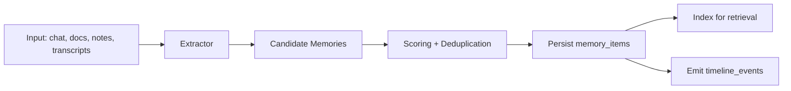
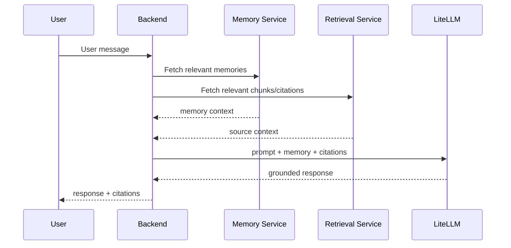

# 07 - AI Memory Architecture

## Objectives

- Maintain useful long-term context across sessions
- Separate ephemeral conversation context from canonical memory
- Keep memory grounded in verifiable sources

## Memory Types

- **Conversation Memory**: short-term context within active chats
- **Long-Term Memory**: persisted facts/preferences/decisions/tasks
- **Timeline Memory**: event-based historical memory for reconstruction

## Memory Ingestion Pipeline

## Stages

1. **Detection**: identify memory-worthy statements/events.
2. **Normalization**: convert candidates to structured schema.
3. **Deduplication**: semantic and rule-based dedupe.
4. **Scoring**: confidence + importance + recency weighting.
5. **Persistence**: write to `memory_items`, link provenance.
6. **Timeline projection**: create/update `timeline_events`.

## Embeddings and Retrieval

- Memory entries receive embeddings for semantic recall.
- Retrieval supports filters:
  - workspace scope
  - memory type
  - recency window
  - confidence threshold

## Context Assembly for Chat

## Safeguards

- only high-confidence memories become durable by default
- user-facing controls to delete/override memories
- sensitive memory classes require explicit policy flags

`TODO`: Define memory privacy classes and redaction policy.

## Conversation vs Long-Term Boundary

- conversation memory auto-expires from hot context window
- long-term memory persists with explicit retention policy
- timeline memory prioritizes explainability and traceability

## Memory Quality Metrics

- memory precision (manual/eval sampled)
- memory recall utility in follow-up sessions
- stale memory rate
- incorrect memory correction rate

## Cross References

- Database schema (`memory_items`, `timeline_events`): `../03-database/README.md`
- RAG integration: `../08-rag/README.md`
- Prompt contracts: `../09-prompts/README.md`
