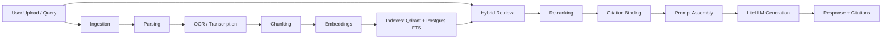
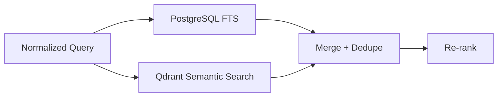

# 01 - RAG Pipeline Architecture

## Objective

Define the Retrieval-Augmented Generation pipeline for Aproko AI Version 1, from ingestion to grounded response generation with citations.

## RAG Principles

- retrieval quality determines answer quality.
- citations are mandatory when grounded context is used.
- optimize for factuality and explainability, not just fluency.
- isolate retrieval by workspace/project scope.
- keep ingestion asynchronous and resilient.

## End-to-End Pipeline

## Stage 1 - File Ingestion

### Inputs

- PDF, DOCX, PPTX, TXT, Markdown, images, audio

### Actions

- upload via signed URL
- register metadata and processing job
- transition source state machine

### Outputs

- source records and queued jobs

## Stage 2 - Parsing

### Actions

- file-type aware parsers extract text/structure
- capture page/slide/section boundaries when available
- normalize extracted text into canonical representation

### Outputs

- structured text blocks + metadata

## Stage 3 - OCR / Transcription

### OCR

- PaddleOCR for image/scanned-text extraction
- confidence metadata attached to extracted segments

### Audio

- transcription pipeline converts audio into timestamped text segments

### Outputs

- enriched text corpus for downstream chunking

Web Step 1 (Sprint 19): browser mic/upload audio is transcribed synchronously with OpenAI Whisper (`whisper-1`) when `OPENAI_API_KEY` is set. Diarization remains deferred.

Web sync PDF ingestion (Sprint 20): text-based PDFs ≤ 12MB are extracted with `unpdf` on upload, chunked into `source_chunks`, and used for lexical search + chat grounding. Scanned PDFs and async worker queues remain deferred.

`TODO`: Async worker queue + diarization strategy for long recordings.

## Stage 4 - Chunking

### Strategy

- structure-aware chunking first (heading/page/slide boundaries)
- token-window fallback with overlap
- preserve source locators for citation rendering

### Suggested Defaults

- chunk size target: 500-900 tokens
- overlap target: 80-140 tokens

### Metadata per Chunk

- workspace_id
- source_id/source_version
- source_type
- locator (page/slide/section/timestamp)
- extraction quality markers

## Stage 5 - Embeddings

### Actions

- generate vector embeddings per chunk
- store vector references and model version metadata

### Outputs

- Qdrant points + relational metadata mappings

`TODO`: Final embedding model and dimensionality decision.

## Stage 6 - Hybrid Search

### Lexical Channel

- exact term and phrase recall
- robust for named entities and literal terms

### Semantic Channel

- concept-level recall and paraphrase robustness

### Merge

- combine channels and deduplicate by source/segment

## Stage 7 - Re-ranking

### Purpose

- improve top-k relevance quality before prompt assembly

### Signals

- semantic score
- lexical score
- recency
- source trust/provenance quality
- diversity across sources

`TODO`: Final ranking weights and evaluation thresholds.

## Stage 8 - Citation Generation

### Citation Contract

Each grounded claim should be traceable to:

- source id/name
- source locator (page/slide/section/timestamp/chunk)
- confidence metadata

### Rules

- if retrieval context is insufficient, model should state uncertainty.
- never fabricate source references.

## Stage 9 - Prompt Assembly

### Inputs

- user query
- selected retrieved chunks
- relevant memory context
- system and policy prompts

### Assembly Constraints

- enforce token budgets
- prioritize highest-confidence chunks
- preserve source diversity
- include citation tags for post-generation mapping

## Stage 10 - Response Generation

### Runtime

- LiteLLM gateway call with selected provider/model
- streaming response for UX responsiveness

### Post-processing

- citation mapping validation
- unsafe/unsupported output checks
- structured payload returned to client

## RAG Failure Modes and Recovery

- **Low retrieval recall** -> fallback query expansion and second-pass retrieve.
- **Noisy OCR segments** -> quality threshold filtering and source-level warning.
- **Overlong context** -> priority truncation and scope reduction.
- **Citation mismatch** -> block/flag response for safe fallback.

## Observability

Track per stage:

- ingestion latency
- parse/OCR success rates
- chunk counts and average sizes
- embedding latency/cost
- retrieval precision@k (offline and sampled online)
- re-rank latency
- citation coverage rate
- end-to-end response latency

## Evaluation Strategy

- offline benchmark set for retrieval and citation correctness
- human-reviewed grounded-answer audits
- regression suite for ingestion and retrieval quality changes

## Security and Privacy

- workspace-level retrieval filters are mandatory.
- no cross-workspace retrieval in shared vector collection without hard filters.
- redact sensitive metadata fields from client-visible citation payload.

## Open TODOs

- `TODO`: Define production fallback order across model providers.
- `TODO`: Define retrieval circuit-breaker thresholds under degraded dependencies.
- `TODO`: Finalize citation confidence rubric for UI presentation.

## Cross References

- Overall architecture: `../02-architecture/01-overall-system-architecture.md`
- User journey: `../02-architecture/02-user-journey.md`
- Memory engine: `../07-ai-memory/01-memory-engine.md`
