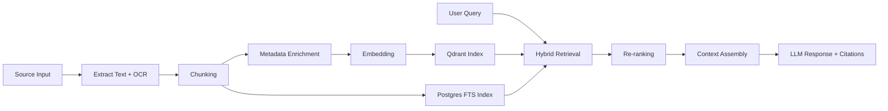

# 08 - Retrieval-Augmented Generation (RAG)

## Goals

- Ground responses in uploaded knowledge
- maximize relevance while minimizing hallucination
- provide reliable citations

## Pipeline Overview

## Chunking Strategy

- Content-aware chunking by document structure when available (heading/section/page)
- Fallback token-window chunking with overlap
- store positional metadata for citation traceability

Recommended defaults:
- target chunk size: 500-900 tokens
- overlap: 80-140 tokens

`TODO`: Final chunk profile per source type (PDF/PPTX/DOCX/TXT/Markdown/transcript/image OCR/audio transcript).

## Metadata Model

Each chunk should carry:
- `workspace_id`
- `source_id`
- `source_type`
- `source_version`
- `page_or_slide`
- `section_path`
- `created_at`
- optional confidence and OCR quality indicators

## Embedding Model Strategy

- primary embedding model routed through LiteLLM-compatible embedding adapter
- migration-safe design: re-embed by model version when needed

`TODO`: Select final embedding model + dimension + cost budget.

## Retrieval Pipeline

1. Query normalization and intent hints
2. Parallel retrieval:
   - lexical (Postgres FTS)
   - semantic (Qdrant ANN)
3. Merge and de-duplicate candidates
4. Re-rank top candidates
5. Build context pack with source diversity controls

## Hybrid Search

Scoring example (configurable):
- 55% semantic score
- 30% lexical score
- 15% recency/authority prior

`TODO`: Calibrate weights using offline evaluation set.

## Citation Generation

Assistant responses should return structured citations:
- `source_id`
- `source_name`
- `locator` (page/slide/section/chunk)
- confidence score

If grounding is weak:
- assistant should respond with uncertainty and request clarifying inputs.

## Ranking and Safety Controls

- cap max chunks per source to reduce dominance
- include contradiction-aware re-ranker pass for sensitive queries
- remove low-quality OCR chunks below threshold

## Evaluation Framework

- retrieval precision@k / recall@k
- citation correctness rate
- answer faithfulness (human+LLM judge)
- latency and token consumption per query class

## Cross References

- Memory integration: `../07-ai-memory/README.md`
- Prompt formatting: `../09-prompts/README.md`
- API contracts: `../04-api/README.md`
