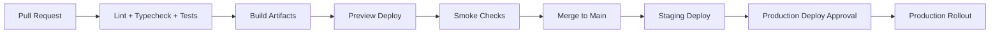

# 11 - Deployment and Operations

## Deployment Targets

- **Frontend**: Vercel (Next.js app)
- **Backend API + workers**: Railway (Dockerized FastAPI and workers)
- **Edge networking/security**: Cloudflare
- **CI/CD**: GitHub Actions

## Environment Strategy

- `development`
- `staging`
- `production`

Each environment has isolated:
- DB schema/database
- storage buckets/prefixes
- queue namespaces
- qdrant collections
- secrets

## CI/CD Workflow

## Container Strategy

- Backend and workers built from Dockerfiles
- deterministic dependency locking
- health/readiness probes required

`TODO`: finalize base image policy and vulnerability scanning standard.

## Secrets and Configuration

- secrets managed in platform env managers only
- no secrets in repo
- rotate keys regularly
- short-lived tokens where possible

## Monitoring and Analytics

- Sentry for error and performance tracing
- PostHog for product analytics
- Vercel Observability for frontend/runtime insights

From reviewed official docs:
- Vercel Observability is available on all plans; paid tiers unlock expanded retention and analysis features.
- Vercel Services enables multi-service path-based routing in one Vercel project (beta).

`TODO`: choose between
1) split-domain deployment (web + api) as default V1, or
2) Vercel Services path-routing experiment for specific environments.

## Operational Dashboards

- API success/error rate
- ingestion queue depth and retry rate
- model latency and token usage by provider/model
- search and retrieval latency
- billing webhook success rate

## Alerting Policy

- P1: auth outage, upload failure surge, 5xx spike
- P2: increased latency, queue lag, OCR failure spike
- P3: cost anomaly, non-critical worker failures

`TODO`: Final alert thresholds and on-call schedule.

## Backup and Recovery

- scheduled DB backups (managed + verified restore drills)
- storage lifecycle and retention backups
- qdrant snapshot/replication strategy

`TODO`: Define RPO/RTO targets and test cadence.

## Security Checklist

- JWT verification and role enforcement
- RLS + backend authorization checks
- TLS everywhere
- dependency scanning in CI
- audit trail for admin operations

## Release Checklist

- schema migrations applied safely
- background jobs compatible with new schema
- feature flags evaluated
- smoke tests passed
- rollback command validated

## Cross References

- Architecture: `../02-architecture/README.md`
- API + data contracts: `../03-database/README.md`, `../04-api/README.md`
- Roadmap phases: `../10-roadmap/README.md`
